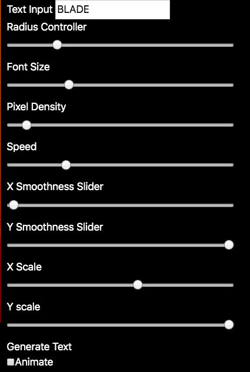

# Using the p5.DOM elements to animate Type.

[See code in action](https://mgn00150905.github.io/GenerativeDesignProjects/Animation_With_DOM) (Ctrl/Cmnd Click to open in new tab)

* This is sketch that animates type pixel by pixel.

* Using p5.DOM, I was able to update the type relative to slider and checkbox element to the right of the canvas.

* I initially used an ellipse for each pixel of the type. However I thought it would be more suiting to use fire SVG's considering the    background.

* Click the Animate box to viiew the animation. Also, play around with the sliders to make your best animation.

* Choose which direction pixels come from before forming the full word by using the __X scale and Y scale__ sliders.

* Alter the smoothness of the pixels by using the __X Smoothness and Y smoothness sliders__.

* There are many other sliders such as __speed density and radius__ that you can change to make the perfect animation.

<!--  -->

