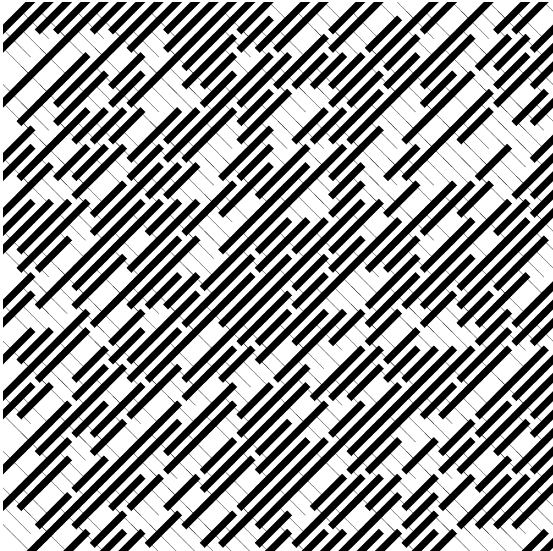

# Drawing multiple lines on a grid system of tiles
## Changing the stroke weight of each line relative to the X and Y mouse co-ordinates

[See code in action](https://mgn00150905.github.io/GenerativeDesignProjects/Shape_Mouse) (Ctrl/Cmnd Click to open in new tab)

