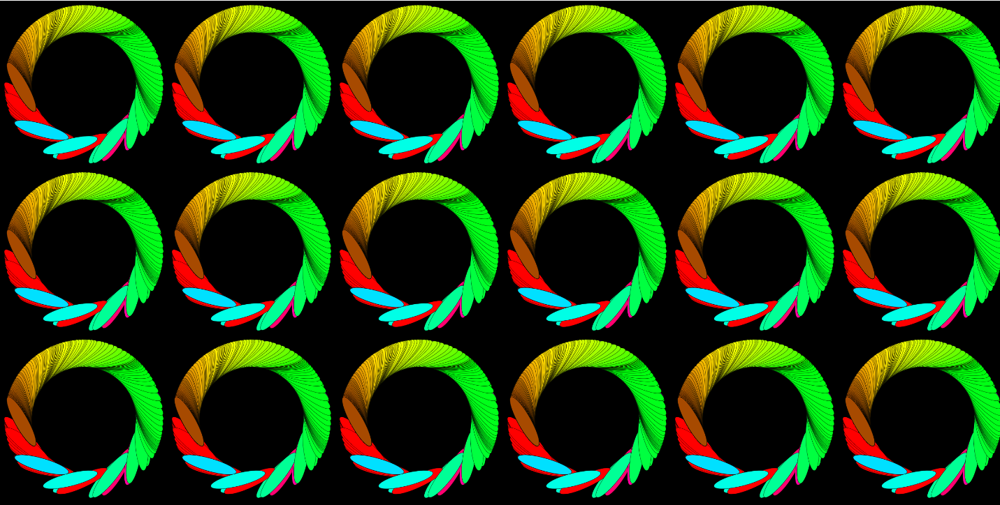

# Drawing multiple circles on a grid system of tiles with rotation
## Using HSB colours relative to mouse co-ordinates

[See code in action](https://mgn00150905.github.io/GenerativeDesignProjects/Shape_Rotation) (Ctrl/Cmnd Click to open in new tab)

